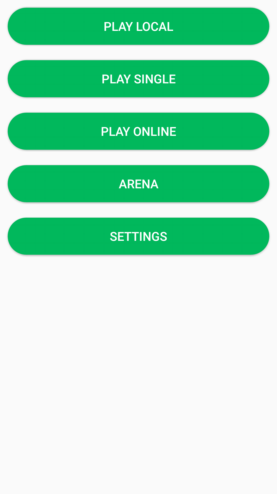
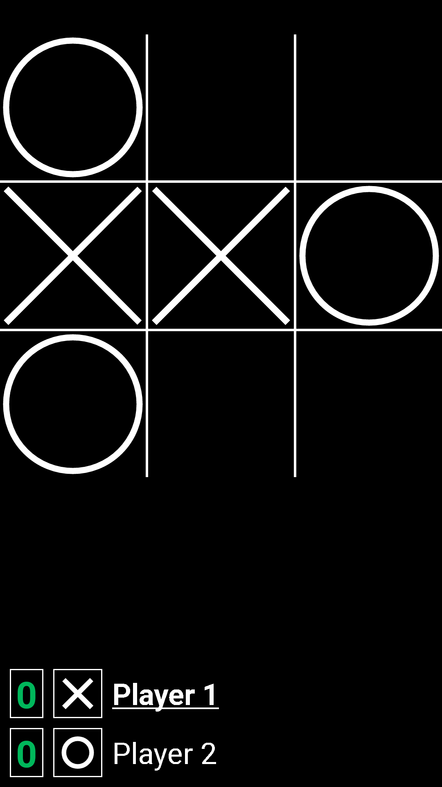
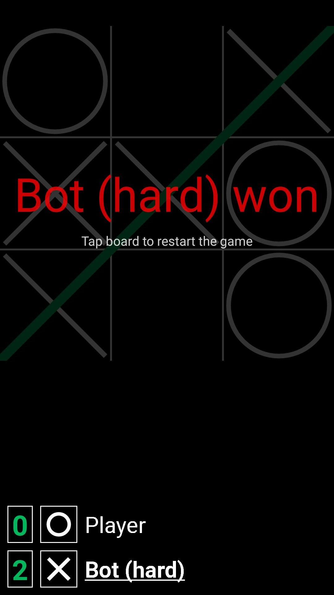

# AndTTT

Android tic-tac-toe game.

## Features

- 3 game modes: Local, Single, Online
- 3 difficulty levels (easy, medium, hard)
- arena where bots fight against each other
- separate room for every online match
- rooms protected with password or not
- light and black (night mode) theme.
- option to enable or disable animations.
- also it has animations.
- did I say it has animations?
- let's not forget about animations.
- option to show or hide Android's status bar
- probably more that I forgot to mention

## Current status

It's mostly playable and usable now, but it is still in beta or maybe even alpha stage.

## Screenshots (version 0.6.1)

 

 

## Public server instance

Not available at the moment.

## Project structure

| Path | Description |
|:----:|:-----------:|
| `app/src/main/java` `app/src/main/res` | Java client code |
| `app/src/main/go` | Go server code |
| `app/src/main/proto` | Protocol Buffers code |
