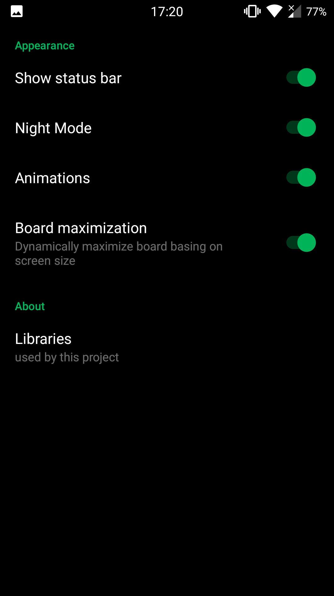
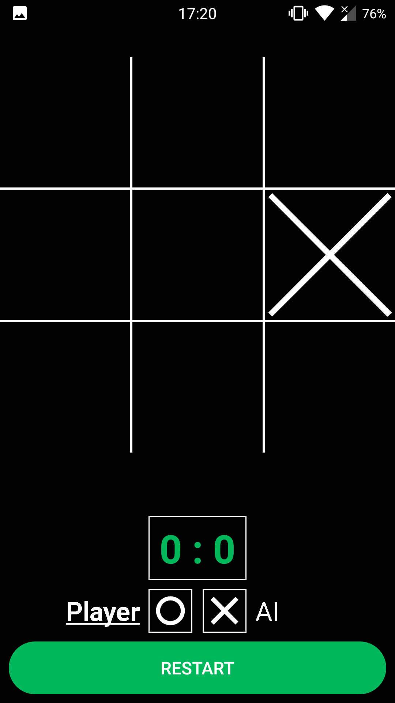
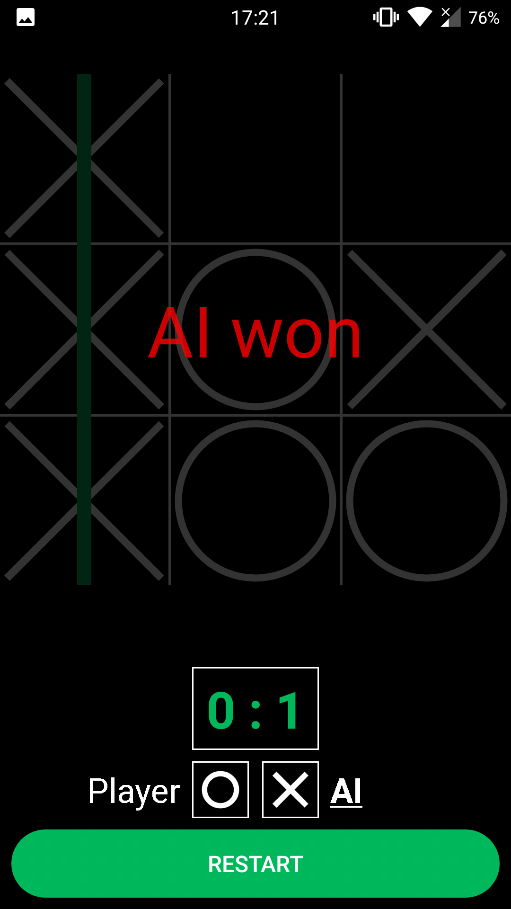

# AndTTT

Android tic-tac-toe game.

### Features

- local player vs player
- local player vs AI (just an algorithm, nothing to see here)
- online player vs player with rooms (password protected or not)
- light and black (night mode) theme
- option to enable or disable animations
- also it has animations
- did i say it has animations?
- option to show or hide Android's status bar

### Current status

It's mostly playable and usable now, but it is still in beta or maybe even alpha stage.

### Screenshots (version 0.5.0)

 

 

### Public server instance

| TCP | HTTP |
|:---:|:---:|
| `srv02.mikr.us:20564` | https://uw564.mikr.us |
